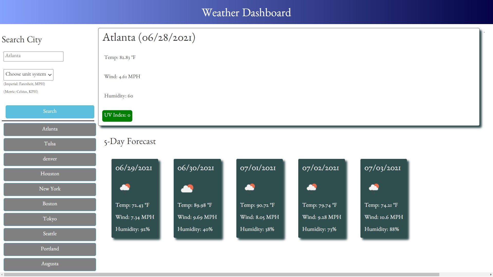
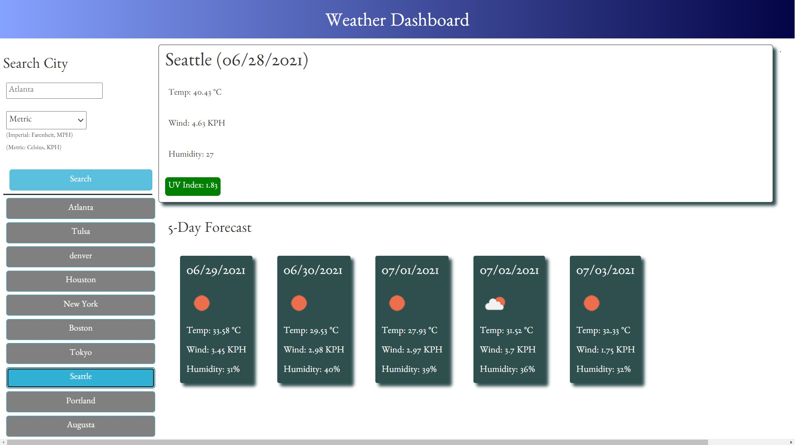
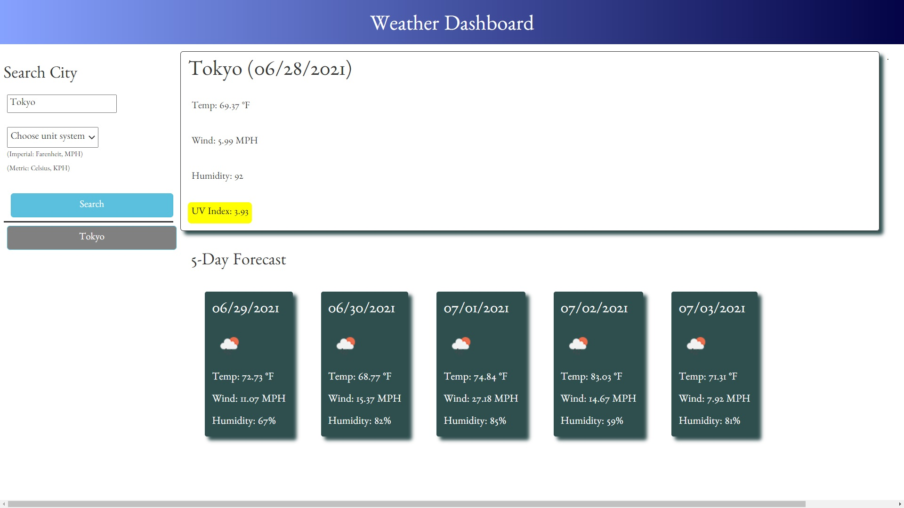

# **Weather Dashboard**
#### By Matilda Brantley 

#### [Live GitHub Page](https://matildabrantley.github.io/weather-dashboard/)

### Summary: Retrieve and display cities' current and forecast weather data from OpenWeather.

## Features
* Ability to search any city and get back current weather and 5-day forecast.
* Two async API calls:
    * getCityCoordinates(city) retrieves latitude and longitude of specified city
    * getWeather(latitude, longitude) calls OpenWeather's One Call to retrieve all needed weather data at once (current and forecast).
* Search history remembers past page visits with localStorage.
* UV Index Scale color displayed (text color changes for readability).
* Forecast includes weather icons from OpenWeather.
* CSS Grid underpins layout, forecast container uses Flexbox.
* Layout works for any screen size.
* Select from Imperial or Metric units (Imperial by default).
* Extra: API call for 5-day forecast every 3 hours if more detailed forecast is needed (not used but coded).

## Screenshots

## Requirements

Given a weather dashboard with form inputs
* When I search for a city
    * Then I am presented with current and future conditions for that city and that city is added to the search history
* When I view current weather conditions for that city
    * Then I am presented with the city name, the date, an icon representation of weather conditions, the temperature, the humidity, the wind speed, and the UV index
* When I view the UV index
    * Then I am presented with a color that indicates whether the conditions are favorable, moderate, or severe
* When I view future weather conditions for that city
    * Then I am presented with a 5-day forecast that displays the date, an icon representation of weather conditions, the temperature, the wind speed, and the humidity
* When I click on a city in the search history
    * Then I am again presented with current and future conditions for that city